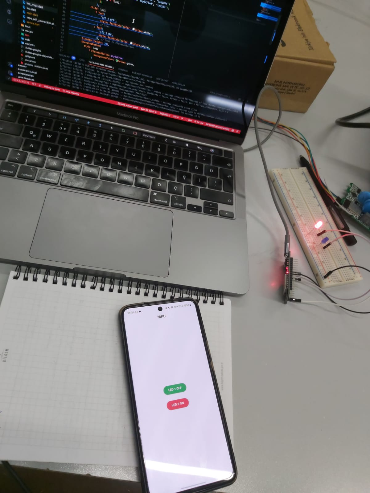
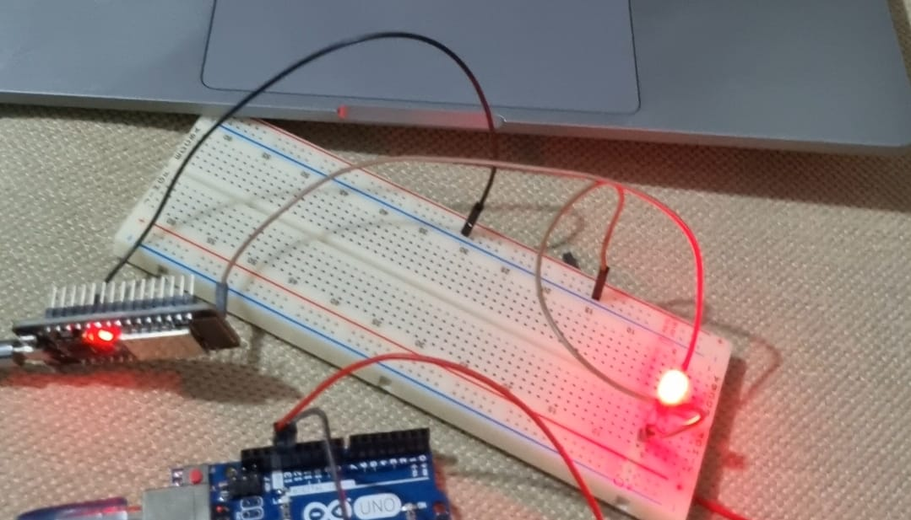

# ESP32 Network-Controlled LED Project

## Overview

This project demonstrates how to control LEDs connected to pins 23 and 4 of an ESP32 device over the network using ModbusIP. When the ESP32 starts, it checks the EEPROM for a stored Wi-Fi SSID and password. If none are found, the device switches to **APSTA mode** to scan for available networks. It lists these networks and connects to the selected one, allowing LED control over Wi-Fi.

## Features

- **EEPROM Check**: At startup, the ESP32 checks the EEPROM for saved SSID and password. If no data is found, it launches in **APSTA mode** to allow network configuration.
  
  

- **Wi-Fi Network Scanning**: In **APSTA mode**, the ESP32 scans for available Wi-Fi networks, displays them, and allows connection.
  
- **ModbusIP LED Control**: Once connected, the ESP32 uses ModbusIP to control LEDs connected to pins 23 and 4 over the network.
  
  

## Workflow

1. **Startup**: The ESP32 checks the EEPROM for saved Wi-Fi credentials. If credentials are found, it connects to the saved network.
   
2. **APSTA Mode**: If no credentials are found, the ESP32 enters APSTA mode, scans for available Wi-Fi networks, and displays them for the user to select and connect.

3. **ModbusIP Control**: After connecting to a network, users can control the LEDs using ModbusIP over the network.

---

## Screenshots

### ESP32 Device

### Wi-Fi Scanning and Control

### ModbusIP LED Control

---

## Contact

For more information or inquiries, feel free to reach out!

---

Thank you for exploring the **ESP32 Network-Controlled LED Project**!

---
---
---

# ESP32 Ağ Üzerinden LED Kontrol Projesi

## Genel Bakış

Bu proje, ESP32 cihazına bağlı 23 ve 4 numaralı pinlerdeki LED'leri ModbusIP üzerinden ağ üzerinden nasıl kontrol edebileceğinizi göstermektedir. ESP32 başlatıldığında, EEPROM'u kaydedilmiş bir Wi-Fi SSID ve parola için kontrol eder. Eğer kayıtlı bir bilgi yoksa, cihaz **APSTA modunda** başlar, mevcut Wi-Fi ağlarını tarar, listeler ve seçilen ağa bağlanır. Bağlandıktan sonra, LED'lerin Wi-Fi üzerinden kontrol edilmesini sağlar.

## Özellikler

- **EEPROM Kontrolü**: Başlangıçta, ESP32 EEPROM'da kayıtlı SSID ve parolayı kontrol eder. Eğer bilgi bulunmazsa, cihaz **APSTA moduna** geçer ve ağ yapılandırmasını sağlar.
  
  

- **Wi-Fi Ağ Taraması**: **APSTA modunda**, ESP32 mevcut Wi-Fi ağlarını tarar, listeler ve bağlantı kurma imkanı sunar.
  
- **ModbusIP ile LED Kontrolü**: Bağlantı kurulduktan sonra, ESP32 ModbusIP kullanarak 23 ve 4 numaralı pinlerdeki LED'leri ağ üzerinden kontrol eder.
  
  

## İş Akışı

1. **Başlatma**: ESP32, başlangıçta EEPROM'u kaydedilmiş Wi-Fi kimlik bilgileri için kontrol eder. Eğer bilgiler mevcutsa, kaydedilen ağa bağlanır.
   
2. **APSTA Modu**: Eğer kimlik bilgileri bulunmazsa, ESP32 APSTA moduna geçer, mevcut Wi-Fi ağlarını tarar ve kullanıcıya seçip bağlanma imkanı sunar.

3. **ModbusIP Kontrolü**: Ağa bağlandıktan sonra, kullanıcılar ModbusIP protokolü üzerinden LED'leri kontrol edebilir.

---

## Ekran Görüntüleri

### ESP32 Cihazı

### Wi-Fi Taraması ve Kontrol

### ModbusIP LED Kontrolü

---

## İletişim

Daha fazla bilgi almak veya sorularınız için bizimle iletişime geçebilirsiniz!

---

**ESP32 Ağ Üzerinden LED Kontrol Projesi'ni** incelediğiniz için teşekkürler!
